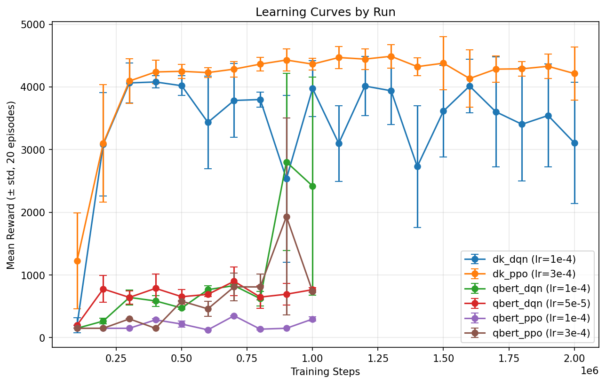
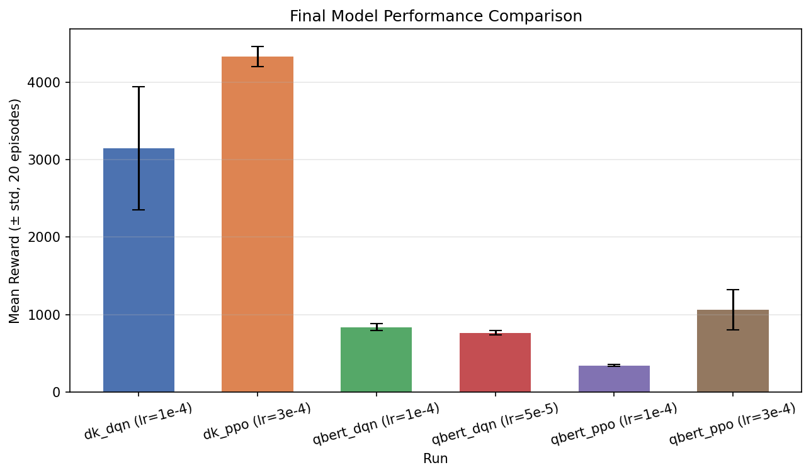

# Summary

## Domains & Setup

**Atari Domains:**

- Qbert 
- Donkey Kong

**Algorithms Used:**

- Deep Q Network (DQN)
- Proximal Policy Optimization (PPO)

**Hyperparameter Variations:**

Each game was trained with specified algorithm and parameters, tested separately with different learning rates.

| Domain | Algorithm | Parameters | Learning Rate(s) |
| --- | --- | --- | --- |
| Qbert | DQN | buffer=100K, batch=32, train_freq=4, target_update=1000 | 1e-4, 5e-5 |
| Qbert | PPO | n_steps=128, batch=256, n_epochs=4, ent_coef=0.01, clip_range=0.1, n_envs=8 | 3e-4, 1e-4 |
| Donkey Kong | DQN | same as Qbert (DQN) | 1e-4 |
| Donkey Kong | PPO | same as Qbert (PPO) | 3e-4 |

**Saved Checkpoints:**

- Qbert: Checkpoint saved every 100,000 timesteps (1,000,000 total)
- Donkey Kong: Checkpoint saved every 100,000 timesteps (2,000,000 total)

---

## Evaluation Scores

### Final Model Performance

| Domain | Algo | Learning Rate | Mean Reward | Std | Min | Max |
| --- | --- | --- | --- | --- | --- | --- |
| Qbert | DQN | 1e-4 | 838.8 | ±47.7 | 800 | 950 |
| Qbert | DQN | 5e-5 | 762.5 | ±29.0 | 725 | 800 |
| Qbert | PPO | 3e-4 | 1062.5 | ±259.0 | 700 | 1275 |
| Qbert | PPO | 1e-4 | 342.5 | ±11.5 | 325 | 350 |
| Donkey Kong | DQN | 1e-4 | 3145.0 | ±797.2 | 2000 | 4100 |
| Donkey Kong | PPO | 3e-4 | 4330.0 | ±130.8 | 4100 | 4600 |

### Learning Curves and Performance Comparison

### Short Observations

- PPO outperformed DQN on both domains
- Lower learning rates led to worse performance, and higher learning rates led to better performance
- Donkey Kong agent learned to prioritize jumping over barrels over completing levels, leading to the learning curve stabilizing quickly
- Qbert was slower to progress, but appeared to make drastic improvements towards the end
